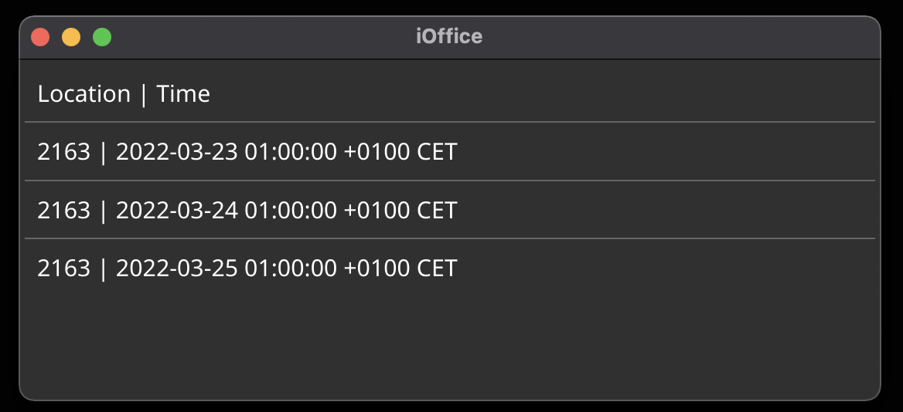

# iOffice-GUI

A GUI version of [alicekaerast/ioffice](https://github.com/alicekaerast/ioffice)

This is always going to be a long way behind the CLI version because it uses that as the library

So far all this does is let you list your upcoming reservations

## Usage

Mac: extract the zip file to your Applications directory

Windows: run the exe file

Provide your username and password from iOffice (doesn't support SSO yet)

Add the hostname (`example` from example.ioffice.com)